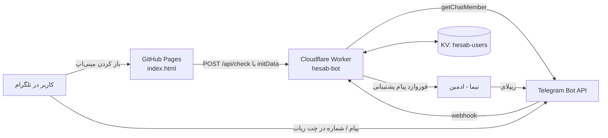

# حساب غذا (Hesab) — نیما داینز

ابزار رایگان «حساب غذا» برای رستوران‌ها و فست‌فودی‌ها: صاحب رستوران غذاهاش و موادشون رو وارد می‌کنه، و ابزار نشون می‌ده **هر غذا واقعاً چقدر سود می‌ده**، کدوم غذا کم‌سوده و قیمتش باید چقدر باشه.

این ابزار به‌شکل **مینی‌اپ تلگرام** داخل ربات نیما داینز اجرا می‌شه. هدف اصلی‌اش (به‌جز کمک به رستوران‌ها) جذب مخاطب به کانال تلگرام و جمع کردن شماره‌ی تماس برای مشاوره است.

> این فایل همه‌ی اطلاعات لازم برای نگهداری، تغییر یا راه‌اندازی دوباره‌ی پروژه رو داره.
> ⚠️ این مخزن **عمومی (Public)** است. هیچ‌وقت توکن ربات یا رمز SETUP_KEY رو داخل هیچ فایلی در این مخزن ننویس.

---

## فهرست

1. [لینک‌ها و مشخصات](#۱-لینکها-و-مشخصات)
2. [کاربر چه چیزی می‌بینه](#۲-کاربر-چه-چیزی-میبینه)
3. [معماری (اجزای پروژه)](#۳-معماری-اجزای-پروژه)
4. [فایل‌های این مخزن](#۴-فایلهای-این-مخزن)
5. [تنظیمات سرور Cloudflare](#۵-تنظیمات-سرور-cloudflare)
6. [دستورهای ادمین در ربات](#۶-دستورهای-ادمین-در-ربات)
7. [نحوه‌ی کار بخش‌ها (جزئیات فنی)](#۷-نحوهی-کار-بخشها-جزئیات-فنی)
8. [فرمول‌های محاسبه](#۸-فرمولهای-محاسبه)
9. [چطور تغییر بدم / به‌روز کنم](#۹-چطور-تغییر-بدم--بهروز-کنم)
10. [راه‌اندازی از صفر (اگه همه‌چیز پاک شد)](#۱۰-راهاندازی-از-صفر-اگه-همهچیز-پاک-شد)
11. [عیب‌یابی](#۱۱-عیبیابی)
12. [محدودیت‌ها، هزینه و امنیت](#۱۲-محدودیتها-هزینه-و-امنیت)
13. [تاریخچه‌ی تغییرات](#۱۳-تاریخچهی-تغییرات)
14. [ایده‌های بعدی](#۱۴-ایدههای-بعدی)

---

## ۱. لینک‌ها و مشخصات

| مورد | مقدار |
|---|---|
| ربات تلگرام (نقطه‌ی ورود کاربرها) | https://t.me/nimasdiner_bot |
| کانال تلگرام (عضویت اجباری) | https://t.me/nimasdiner |
| اینستاگرام | https://instagram.com/nimasdiner |
| صفحه‌ی مینی‌اپ (GitHub Pages) | https://nimania.github.io/Hesab/ |
| مخزن گیت‌هاب | https://github.com/nimania/Hesab |
| سرور (Cloudflare Worker) | https://hesab-bot.nimania.workers.dev |
| صفحه‌ی بررسی سلامت/راه‌اندازی | `https://hesab-bot.nimania.workers.dev/setup?key=SETUP_KEY` |
| حساب Cloudflare | nimania@gmail.com — زیردامنه‌ی `nimania.workers.dev` |
| اسم Worker در Cloudflare | `hesab-bot` |
| اسم KV (دیتابیس) | `hesab-users` (ID: `0ff8c3e0f528484799f086ef5cb99386`) — با اسم متغیر `USERS` به Worker وصله |
| هزینه | رایگان (پلن رایگان GitHub Pages و Cloudflare Workers) |

> ورکر دیگه‌ی `pendar-api-proxy` در همین حساب Cloudflare مربوط به پروژه‌ی دیگه‌ست؛ به این پروژه ربطی نداره.

---

## ۲. کاربر چه چیزی می‌بینه

1. ربات **@nimasdiner_bot** رو باز می‌کنه و `/start` می‌زنه ← پیام خوش‌آمد + دکمه‌ی «📱 ارسال شماره موبایل» + دکمه‌ی «🧮 باز کردن حساب غذا». دکمه‌ی منوی پایین چت هم «حساب غذا» است.
2. مینی‌اپ باز می‌شه و دسترسی رو بررسی می‌کنه:
   - **بیرون از تلگرام باز شده؟** ← صفحه‌ی «حساب غذا داخل تلگرام باز می‌شه» + دکمه‌ی رفتن به ربات.
   - **عضو کانال نیست؟** ← صفحه‌ی «اول عضو کانال نیما داینز شو» + دکمه‌ی عضویت + «عضو شدم، ادامه بده».
   - **شماره نداده؟** ← صفحه‌ی «یه قدم مونده: شماره‌ی موبایلت» + دکمه‌ی ارسال شماره با تلگرام (یا ارسال در چت ربات).
   - **سرور در دسترس نیست؟** ← «الان نتونستم بررسی کنم» + دکمه‌ی تلاش دوباره. (اگه کاربر در ۳ روز اخیر تأیید شده باشه، بدون بررسی وارد می‌شه.)
3. بعد از عبور از این مراحل، خود ابزار با سه قدم:
   - **قدم ۱ – غذاها و موادش:** اسم غذا، قیمت فروش، هزینه‌ی بسته‌بندی، و مواد هر پرس (مقدار خرید، قیمت خرید، واحد، درصد دورریز، مقدار مصرف در هر پرس).
   - **قدم ۲ – فروش ماه:** تعداد تقریبی فروش هر غذا در یک ماه (اختیاری).
   - **قدم ۳ – کارنامه‌ی منو:** برای هر غذا: قیمت فروش، خرج هر پرس، سود هر پرس، سود ماه، درصد خرج مواد، وضعیت (سالم / حواست باشه / کم‌سود)، قیمت پیشنهادی، دسته‌ی مهندسی منو (ستاره / پرفروش کم‌سود / پرسود کم‌فروش / کم‌فروش کم‌سود)، و دکمه‌ی «پیام به نیما» برای غذاهای مشکل‌دار.
4. دکمه‌ی «سؤال داری؟» در همه‌ی صفحه‌ها: پیام خصوصی (از طریق ربات)، کانال، تلفن، اینستاگرام، ایمیل.
5. «نمونه رو ببین»: داده‌ی نمونه (همبرگر کلاسیک، ساندویچ مرغ، سیب‌زمینی سرخ‌کرده، نوشابه) برای آشنایی.

**پشتیبانی:** هر پیامی که کاربر در چت ربات بنویسه (متن، عکس، ویس، فایل…) برای نیما فرستاده می‌شه (همراه اسم، یوزرنیم، شماره و آیدی). نیما روی پیام **ریپلای** می‌کنه و جوابش از طرف ربات به کاربر می‌رسه. اکانت شخصی نیما مخفی می‌مونه.

---

## ۳. معماری (اجزای پروژه)



- **index.html (روی GitHub Pages):** کل رابط کاربری و محاسبات. داده‌های غذاها فقط روی گوشی خود کاربر (localStorage) ذخیره می‌شه و به سرور نمی‌ره.
- **worker.js (روی Cloudflare Workers):** سرور کوچک که توکن ربات فقط اونجاست. کارهاش: بررسی عضویت کانال، ذخیره‌ی کاربرها و شماره‌ها، رله‌ی پیام‌های پشتیبانی، آمار و خروجی اکسل.
- **KV:** دیتابیس ساده‌ی کلید-مقدار Cloudflare برای کاربرها و نگاشت پیام‌های پشتیبانی.
- **ربات @nimasdiner_bot:** در کانال @nimasdiner **ادمین** است (بدون هیچ دسترسی خاص) تا بتونه عضویت رو بررسی کنه.

چرا سرور جدا؟ چون بررسی عضویت کانال به توکن ربات نیاز داره و گذاشتن توکن داخل index.html (که عمومیه) یعنی لو رفتن ربات.

---

## ۴. فایل‌های این مخزن

| فایل | توضیح |
|---|---|
| `index.html` | مینی‌اپ (تک‌فایل: HTML + CSS + JS). روی GitHub Pages منتشر می‌شه. |
| `worker.js` | **نسخه‌ی پشتیبان** کد سرور. نسخه‌ی در حال اجرا داخل Cloudflare است؛ این فایل فقط برای نگهداری و بازگردانیه. هر وقت کد ورکر رو در Cloudflare عوض کردی، این فایل رو هم به‌روز کن. |
| `README.md` | همین مستندات. |

### تنظیمات بالای `index.html`

```js
const CONFIG = {
  api: "https://hesab-bot.nimania.workers.dev",   // آدرس سرور Cloudflare
  channel: "nimasdiner",                            // کانالی که عضویتش لازمه (بدون @)
  bot: "nimasdiner_bot"                             // ربات پشتیبانی (بدون @)
};
const CONTACT = {
  phone: "09123107537",
  telegram: "https://t.me/" + CONFIG.bot,           // پیام خصوصی از طریق ربات
  channel: "https://t.me/" + CONFIG.channel,
  instagram: "https://instagram.com/nimasdiner",
  email: "nimania@gmail.com"
};
```

برای عوض کردن شماره تماس، ایمیل، کانال یا ربات فقط همین بخش رو ویرایش کن.

---

## ۵. تنظیمات سرور Cloudflare

مسیر: Cloudflare ← Workers & Pages ← `hesab-bot` ← Settings

### متغیرها (Variables and secrets)

| نام | نوع | مقدار |
|---|---|---|
| `BOT_TOKEN` | Secret | توکن ربات از BotFather (`/mybots` ← nimasdiner_bot ← API Token) |
| `SETUP_KEY` | Secret | رمز دلخواه نیما (جایی امن نگه‌داری می‌شه، **نه در این مخزن**) |
| `CHANNEL` | Text | `@nimasdiner` |
| `APP_URL` | Text | `https://nimania.github.io/Hesab/` |

### Bindings

| نوع | اسم متغیر | مقدار |
|---|---|---|
| KV namespace | `USERS` | `hesab-users` |

### آدرس‌های سرور

| مسیر | کاربرد |
|---|---|
| `GET /` | فقط پیام «ربات حساب غذا روشن است ✅» (برای تست زنده بودن) |
| `GET /setup?key=SETUP_KEY` | اتصال webhook ربات، تنظیم دکمه‌ی منو و دستورها، و گزارش سلامت (توکن، ادمین بودن ربات در کانال، ادمین پشتیبانی). **هر بار که توکن یا آدرس ورکر عوض شد باید دوباره باز بشه.** اجرای دوباره‌اش بی‌خطره. |
| `POST /webhook` | پیام‌های تلگرام به اینجا می‌رسن (با هدر امنیتی `X-Telegram-Bot-Api-Secret-Token` که از SETUP_KEY ساخته می‌شه). |
| `POST /api/check` | مینی‌اپ `initData` تلگرام رو می‌فرسته؛ جواب: `{ok, member, hasPhone}` |

---

## ۶. دستورهای ادمین در ربات

| دستور | کار |
|---|---|
| `/admin SETUP_KEY` | فرستنده رو ادمین پشتیبانی می‌کنه (فقط یک نفر؛ آخرین کسی که بفرسته). |
| ریپلای روی پیام کاربر | جواب رو به همون کاربر می‌فرسته (متن، عکس، ویس، فایل…). نگاشت پیام‌ها ۶۰ روز نگه داشته می‌شه. |
| `/stats` | تعداد کل کاربرها، کاربرهای با شماره، جدیدهای ۲۴ ساعت و ۷ روز. |
| `/export` | فایل `hesab-users.csv` (قابل باز شدن در اکسل) با آیدی، اسم، یوزرنیم، شماره، تاریخ اولین ورود و تاریخ ثبت شماره. |
| `/start` یا `/help` (از طرف ادمین) | راهنمای ادمین + دکمه‌ی باز کردن ابزار. |

هر وقت کاربر جدیدی شماره‌اش رو ثبت کنه، پیام «🆕 کاربر جدید» برای ادمین میاد.

---

## ۷. نحوه‌ی کار بخش‌ها (جزئیات فنی)

### بررسی دسترسی (در index.html)

- تشخیص تلگرام: وجود `tgWebApp` در `location.hash` و خالی نبودن `Telegram.WebApp.initData`. اسکریپت `telegram-web-app.js` فقط داخل تلگرام بارگذاری می‌شه.
- تابع `checkAccess()` درخواست `POST {CONFIG.api}/api/check` با `{initData}` می‌فرسته (مهلت ۱۲ ثانیه).
- وضعیت‌ها (`gate`): `outside` | `loading` | `join` | `phone` | `error` | `ok`. تا وقتی `ok` نشده، تابع `vGate()` صفحه‌ی مربوط رو نشون می‌ده و ابزار قفله.
- ارسال شماره: `Telegram.WebApp.requestContact()` (نسخه‌ی ۶.۹ به بالا). تلگرام شماره رو به‌صورت پیام contact به ربات می‌فرسته، ورکر ذخیره‌اش می‌کنه و مینی‌اپ چند بار (هر ۱.۵ ثانیه، حداکثر ۸ بار) دوباره بررسی می‌کنه. در نسخه‌های قدیمی تلگرام، کاربر به چت ربات (`?start=phone`) فرستاده می‌شه.
- مهلت آفلاین: اگه سرور جواب نده ولی کاربر در ۳ روز اخیر تأیید شده باشه، وارد می‌شه.

### کلیدهای localStorage (روی گوشی کاربر)

| کلید | محتوا |
|---|---|
| `nimadines-hesab-v1` | همه‌ی داده‌های ابزار: مواد، غذاها، فروش، هدف درصد خرج، حالت آنلاین و کمیسیون |
| `nimadines-hesab-auth` | زمان آخرین تأیید موفق دسترسی (برای مهلت آفلاین ۳ روزه) |

### امنیت initData (در worker.js)

`verifyInitData()` امضای HMAC-SHA256 تلگرام رو با توکن ربات بررسی می‌کنه (طبق مستندات رسمی Telegram Mini Apps) و داده‌ی قدیمی‌تر از ۲ روز رو رد می‌کنه. پس کسی نمی‌تونه خودش رو جای کاربر دیگه جا بزنه.

### بررسی عضویت

`getChatMember(CHANNEL, userId)`؛ وضعیت‌های قابل قبول: `creator`، `administrator`، `member`، یا `restricted` با `is_member = true`. ربات باید در کانال ادمین باشه، وگرنه این درخواست خطا می‌ده.

### ساختار داده در KV

| کلید | مقدار |
|---|---|
| `u:<userId>` | رکورد کاربر (JSON و همچنین metadata): `id, first_name, last_name, username, phone, first_seen, phone_at` |
| `m:<messageId>` | آیدی کاربری که پیام پشتیبانی متعلق به اونه (برای ریپلای). انقضا: ۶۰ روز |
| `admin` | آیدی عددی تلگرام ادمین پشتیبانی |

شماره فقط وقتی ذخیره می‌شه که `contact.user_id` با فرستنده یکی باشه (کسی نمی‌تونه شماره‌ی دیگری رو جای خودش بفرسته). شماره‌ها با `+` ذخیره می‌شن (مثلاً `+98912…`).

---

## ۸. فرمول‌های محاسبه

- **قیمت واحد هر ماده** = قیمت خرید ÷ (مقدار خرید × ضریب واحد × (۱ − درصد دورریز))
  - واحدها: کیلوگرم=۱۰۰۰ گرم، لیتر=۱۰۰۰ میلی‌لیتر، عدد=۱
  - دورریز: ۰٪، ۱۰٪، ۲۵٪، ۴۰٪
- **خرج هر پرس** = جمع (قیمت واحد × مقدار مصرف در پرس) + هزینه‌ی بسته‌بندی
- **درصد خرج مواد (Food Cost)** = خرج هر پرس ÷ قیمت فروش
- **هدف** قابل انتخاب: ۳۰، ۳۵ (پیش‌فرض)، ۴۰ درصد
- **وضعیت:** سبز اگه ≤ هدف؛ زرد اگه ≤ هدف + ۸٪؛ قرمز بیشتر از اون
- **قیمت پیشنهادی** = خرج هر پرس ÷ هدف، گرد به بالا تا ۱۰۰۰ تومان
- **سود هر پرس آنلاین** = قیمت × (۱ − کمیسیون) − خرج (کمیسیون پیش‌فرض ۲۰٪)
- **مهندسی منو** (وقتی دست‌کم ۲ غذا فروش دارن):
  - پرفروش = سهم فروش ≥ ۰.۷ ÷ تعداد غذاها (قانون ۷۰٪)
  - پرسود = سود هر پرس ≥ میانگین وزنی سود هر پرس
  - ستاره (پرفروش+پرسود)، پرفروش کم‌سود، پرسود کم‌فروش، کم‌فروش کم‌سود

---

## ۹. چطور تغییر بدم / به‌روز کنم

### تغییر ظاهر یا متن‌های مینی‌اپ
1. `index.html` جدید رو آماده کن (یا از Claude بخواه).
2. گیت‌هاب ← مخزن Hesab ← **Add file ← Upload files** ← فایل رو بنداز ← **Commit changes**.
3. در تب **Actions** صبر کن تا «pages build and deployment» سبز بشه (حدود ۱ دقیقه).
4. در تلگرام مینی‌اپ رو کامل ببند و دوباره باز کن.

### تغییر کد سرور
1. Cloudflare ← Workers & Pages ← `hesab-bot` ← **Edit code**.
2. کل کد رو با نسخه‌ی جدید جایگزین کن ← **Deploy**.
3. همون کد رو در فایل `worker.js` این مخزن هم آپلود کن تا نسخه‌ی پشتیبان به‌روز بمونه.

### عوض کردن توکن ربات (مثلاً اگه لو رفت)
1. BotFather ← `/revoke` ← nimasdiner_bot ← توکن جدید.
2. Cloudflare ← hesab-bot ← Settings ← Variables ← `BOT_TOKEN` ← مداد ✏️ ← توکن جدید ← Deploy.
3. صفحه‌ی `/setup?key=...` رو دوباره باز کن تا webhook با توکن جدید وصل بشه.

### عوض کردن رمز SETUP_KEY
Settings ← Variables ← `SETUP_KEY` ← ✏️ ← رمز جدید ← Deploy ← باز کردن `/setup?key=رمز_جدید` (چون هدر امنیتی webhook از این رمز ساخته می‌شه، **حتماً** setup رو دوباره اجرا کن).

### عوض کردن ادمین پشتیبانی
از اکانت جدید در ربات بفرست: `/admin SETUP_KEY`

### عوض کردن کانال
`CHANNEL` در Cloudflare و `channel` در `CONFIG` داخل index.html رو عوض کن، ربات رو در کانال جدید ادمین کن و setup رو دوباره باز کن.

---

## ۱۰. راه‌اندازی از صفر (اگه همه‌چیز پاک شد)

1. **ربات:** در BotFather ربات بساز (یا از nimasdiner_bot استفاده کن) و توکن بگیر.
2. **Worker:** Cloudflare ← Workers & Pages ← Create application ← Start with Hello World ← اسم `hesab-bot` ← Deploy ← Edit code ← محتوای `worker.js` این مخزن ← Deploy.
3. **KV:** Settings ← Bindings ← Add binding ← KV namespace ← اسم متغیر `USERS` ← ساخت/انتخاب `hesab-users`.
4. **متغیرها:** چهار متغیر بخش ۵ (BOT_TOKEN و SETUP_KEY از نوع Secret).
5. **کانال:** ربات رو در @nimasdiner ادمین کن (همه‌ی دسترسی‌ها خاموش).
6. **Setup:** مرورگر ← `https://hesab-bot.nimania.workers.dev/setup?key=SETUP_KEY` ← همه‌ی موارد باید ✅ باشن.
7. **ادمین:** در ربات بفرست `/admin SETUP_KEY`.
8. **مینی‌اپ:** اگه آدرس ورکر عوض شده، `CONFIG.api` در index.html رو عوض کن و آپلود کن. GitHub Pages باید از شاخه‌ی `main` (پوشه‌ی root) فعال باشه (Settings ← Pages).
9. **تست:** با یک اکانت غیرعضو: عضویت ← شماره ← باز شدن ابزار ← پیام پشتیبانی و ریپلای.

> اگه KV پاک بشه، لیست کاربرها و شماره‌ها از بین می‌ره. هر چند وقت یک بار `/export` بگیر و فایل رو جایی (غیر از این مخزن عمومی) نگه دار.

---

## ۱۱. عیب‌یابی

| مشکل | علت احتمالی / راه‌حل |
|---|---|
| مینی‌اپ همیشه «الان نتونستم بررسی کنم» | سرور در دسترس نیست یا `CONFIG.api` اشتباهه. آدرس `https://hesab-bot.nimania.workers.dev` رو در مرورگر باز کن؛ باید «روشن است ✅» ببینی. اگه ربات در کانال ادمین نباشه هم همین خطا میاد (setup رو باز کن). |
| عضو کانال شده ولی می‌گه عضو نیستی | چند ثانیه صبر و دوباره «عضو شدم» بزنه. مطمئن شو `CHANNEL` دقیقاً `@nimasdiner` است. |
| شماره ثبت نمی‌شه | کاربر شماره رو از چت ربات با دکمه‌ی «📱 ارسال شماره موبایل» بفرسته (`/start`). اگه webhook قطع شده باشه، setup رو دوباره باز کن. |
| پیام‌های پشتیبانی به نیما نمی‌رسه | در ربات `/admin SETUP_KEY` بفرست. setup رو باز کن و ببین «ادمین پشتیبانی ✅» باشه. |
| ریپلای نیما به کاربر نمی‌رسه | باید روی پیام خود کاربر (یا پیام سربرگ بالاش) ریپلای بشه. پیام‌های قدیمی‌تر از ۶۰ روز دیگه قابل ریپلای نیستن. شاید کاربر ربات رو بلاک کرده. |
| «کلید نادرست است» در صفحه‌ی setup | رمز بعد از `key=` با SETUP_KEY در Cloudflare یکی نیست. |
| تغییر index.html دیده نمی‌شه | تب Actions گیت‌هاب سبز شده باشه؛ مینی‌اپ رو کامل ببند و باز کن. |
| دیدن خطاهای سرور | Cloudflare ← hesab-bot ← **Observability** (لاگ‌ها روشن‌اند). |

---

## ۱۲. محدودیت‌ها، هزینه و امنیت

- **پلن رایگان Cloudflare:** روزانه ۱۰۰٬۰۰۰ درخواست، و در KV روزانه ۱۰۰٬۰۰۰ خواندن و **۱٬۰۰۰ نوشتن**. هر کاربر جدید و هر پیام پشتیبانی چند نوشتن مصرف می‌کنه؛ برای چند صد کاربر در روز کافیه. اگه خیلی رشد کرد، پلن پولی Workers (حدود ۵ دلار در ماه) یا انتقال به D1.
- **دسترسی از ایران:** تلگرام در ایران فیلتره، پس کاربرها با فیلترشکن وارد می‌شن و همون فیلترشکن برای `github.io` و `workers.dev` هم کار می‌کنه.
- **قفل سمت کاربره:** بررسی عضویت داخل صفحه انجام می‌شه. برای کاربر عادی کافیه، ولی چون کد در این مخزن عمومیه، یک برنامه‌نویس می‌تونه صفحه رو بدون قفل اجرا کنه. داده‌ای در معرض خطر نیست؛ فقط ابزار رایگان بدون عضویت استفاده می‌شه.
- **حریم خصوصی:** داده‌های منوی رستوران‌ها فقط روی گوشی خودشونه. فقط اسم، یوزرنیم، آیدی و شماره (با رضایت خود کاربر از طریق دکمه‌ی تلگرام) در KV ذخیره می‌شه. به کاربر گفته شده «شماره‌ات فقط پیش نیما می‌مونه».
- **رازها:** `BOT_TOKEN` و `SETUP_KEY` فقط در Cloudflare (Secret) هستن. هیچ‌وقت در این مخزن، اسکرین‌شات یا چت نذارشون.

---

## ۱۳. تاریخچه‌ی تغییرات

| تاریخ | نسخه | تغییرات |
|---|---|---|
| ۱۴۰۵/۰۷/۰۲ (2026-09-24) | ۱ | نسخه‌ی اول مینی‌اپ: سه قدم (غذاها، فروش، کارنامه)، محاسبه‌ی خرج با دورریز و واحد، مهندسی منو، حالت آنلاین/کمیسیون، نمونه، راه‌های تماس، هماهنگی با تلگرام. |
| ۱۴۰۵/۰۷/۰۲ (2026-09-24) | ۲ | سرور Cloudflare Worker (`hesab-bot`) + KV. عضویت اجباری در @nimasdiner، گرفتن اجباری شماره‌ی موبایل، پشتیبانی از طریق ربات با ریپلای، دستورهای `/stats` و `/export`، صفحه‌ی `/setup`. لینک پیام خصوصی به ربات تغییر کرد و لینک کانال به راه‌های تماس اضافه شد. تست کامل انجام و در تلگرام تأیید شد. |

---

## ۱۴. ایده‌های بعدی

- پیام گروهی (Broadcast) از ادمین به همه‌ی کاربرهای ربات (مثلاً برای معرفی مجله‌ی «داینر» یا ویدیوهای جدید).
- پیام خوش‌آمد بهتر و دنباله‌ی پیام‌های آموزشی خودکار بعد از ثبت‌نام.
- ذخیره‌ی داده‌های منوی کاربر در CloudStorage تلگرام تا با عوض کردن گوشی از بین نره.
- خروجی PDF/عکس کارنامه‌ی منو برای اشتراک‌گذاری (همراه لوگوی نیما داینز).
- اتصال دامنه‌ی اختصاصی به‌جای `workers.dev` و `github.io`.
